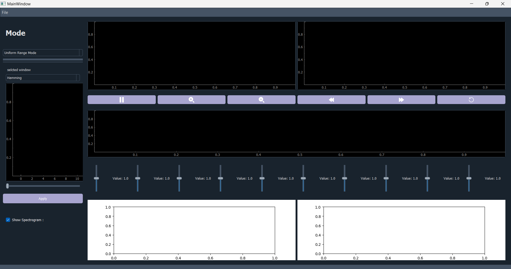
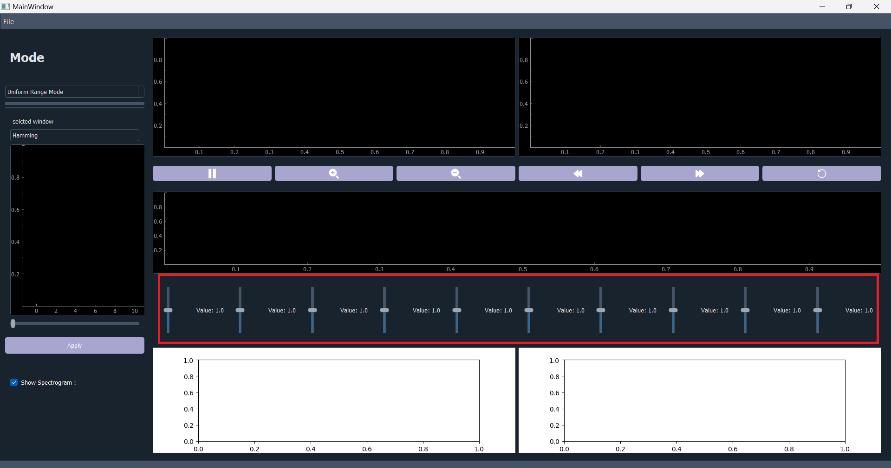
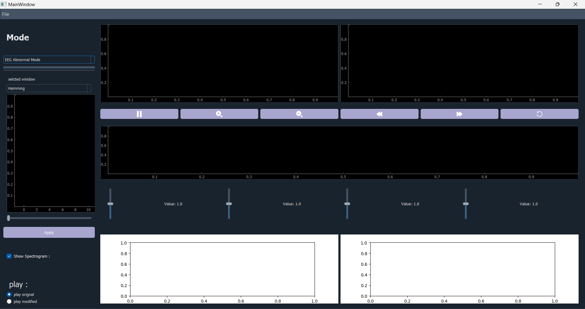
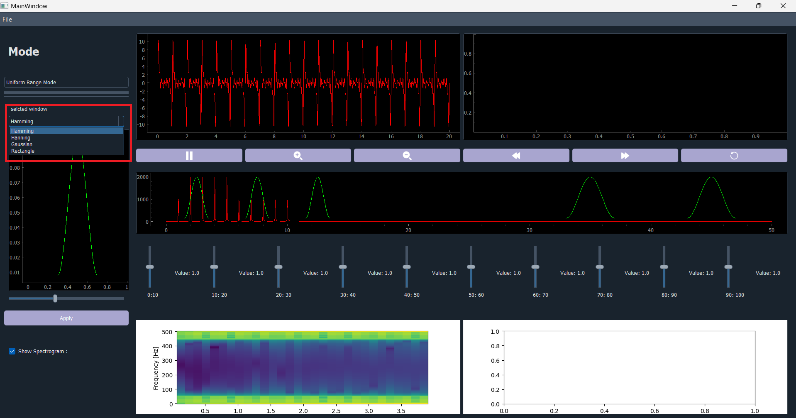
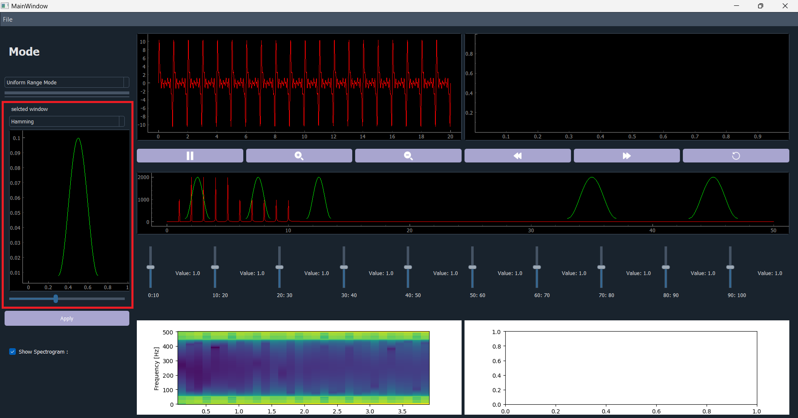
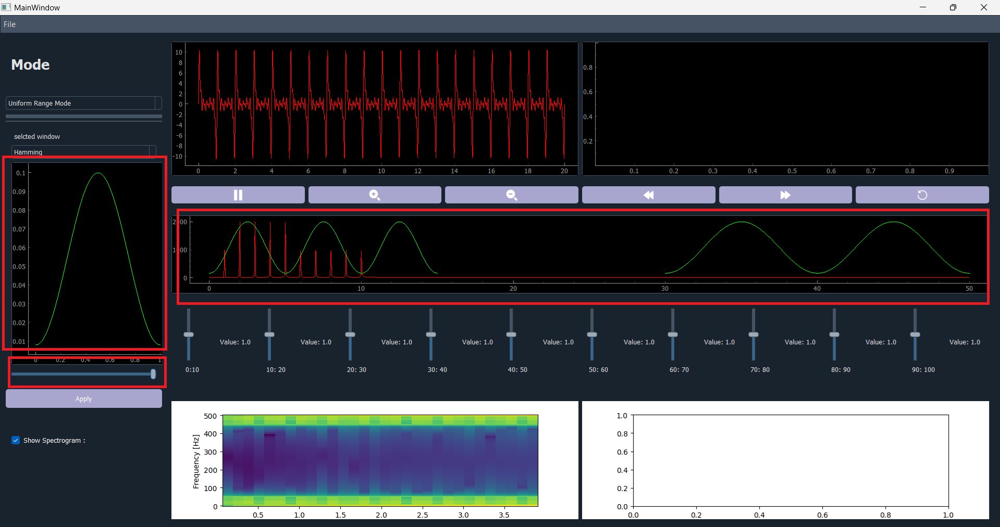
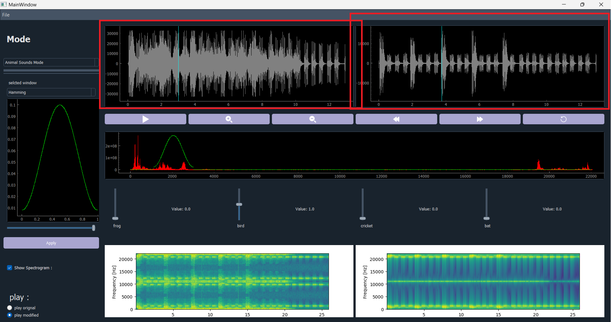
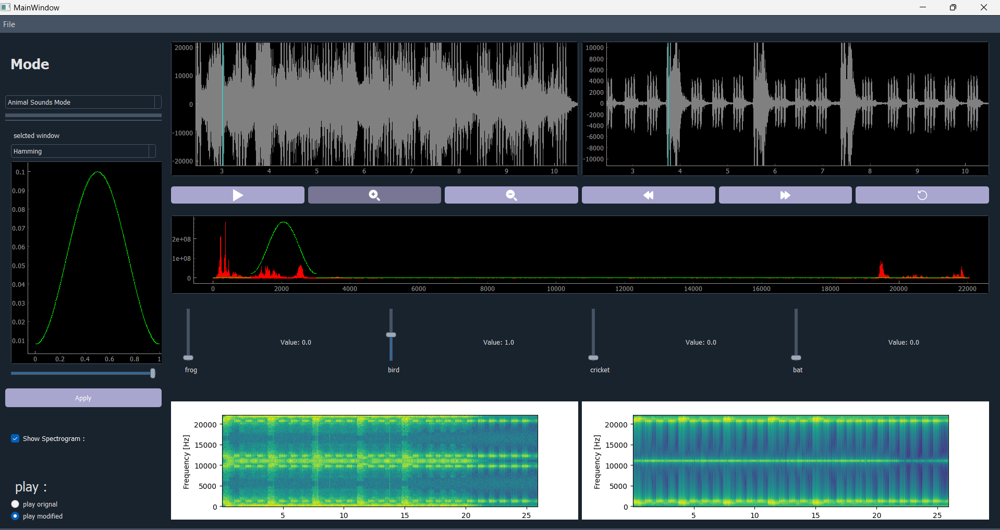
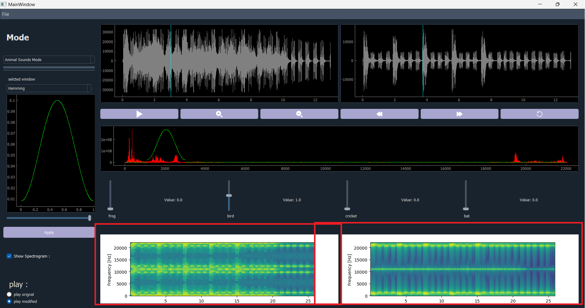
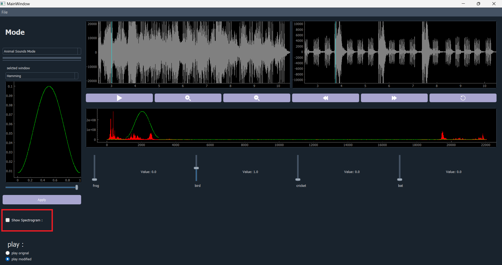

# Signal Equalizer Application

Welcome to the Signal Equalizer Application! This desktop application allows users to open a signal, adjust the magnitude of specific frequency components using sliders, and reconstruct the modified signal. The application operates in different modes, each with specific functionalities tailored to different signal types.

## Table of Contents

1. [Overview](#overview)
2. [Modes](#modes)
   - [Uniform Range Mode](#uniform-range-mode)
   - [Musical Instruments Mode](#musical-instruments-mode)
   - [Animal Sounds Mode](#animal-sounds-mode)
   - [ECG Abnormalities Mode](#ecg-abnormalities-mode)
3. [Smoothing Windows](#smoothing-windows)
4. [User Interface](#user-interface)
5. [Two Signal Viewers](#two-signal-viewers)
6. [Spectrograms](#spectrograms)
7. [Code Practices](#code-practices)

## Overview

The Signal Equalizer Application is a versatile tool that empowers users to modify the frequency components of a signal through an intuitive interface. Explore different modes, apply equalization using sliders, and visualize the changes in both time and frequency domains.

## Modes

### Uniform Range Mode

 **Description:** In this mode, the total frequency range of the input signal is divided uniformly into 10 equal ranges, each controlled by a slider.

### Musical Instruments Mode

 **Description:** Each slider controls the magnitude of a specific musical instrument in the input music signal, composed of at least four different instruments.

### Animal Sounds Mode

 **Description:** Each slider controls the magnitude of specific animal sounds in a mixture of at least four animal sounds.

 

### ECG Abnormalities Mode

1. **Description:** Sliders control the magnitude of arrhythmia components in the input signal, with four ECG signals provided (one normal and three with specific arrhythmias).

 

## Smoothing Windows

1. **Description:** Four multiplication/smoothing windows (Rectangle, Hamming, Hanning, Gaussian) are available for the user to choose from.

 

2. **Customization:** Users can visually customize the parameters of the chosen window before applying it to the equalizer.

 

## User Interface

1. **Switching Modes:** Users can easily switch between modes through an option menu or combobox. The UI adapts to changes in sliders captions and their number.

2. **Sliders:** Sliders allow users to adjust the magnitude of frequency components. The multiplication with the corresponding slider value undergoes a multiplication/smoothing window.

## Two Signal Viewers

1. **Description:** Two  signal viewers, one for the input and one for the output signals, provide a full set of functionality (play/stop/pause/speed-control/zoom/pan/reset).

2. **Synchronous Viewing:** The viewers are linked, showing the same exact time-part of the signal when scrolled or zoomed.

## Spectrograms

1. **Description:** Two spectrograms, one for the input and one for the output signals, reflect changes in real-time as sliders are adjusted.

2. **Toggle Visibility:** Users can toggle the visibility of the spectrograms.

----
